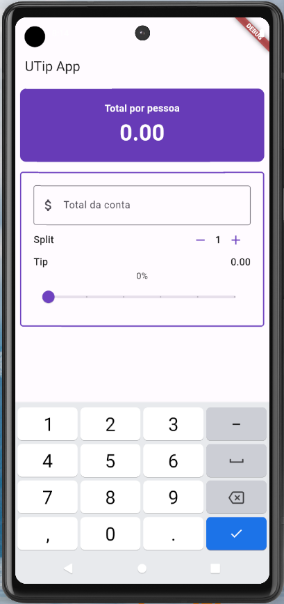
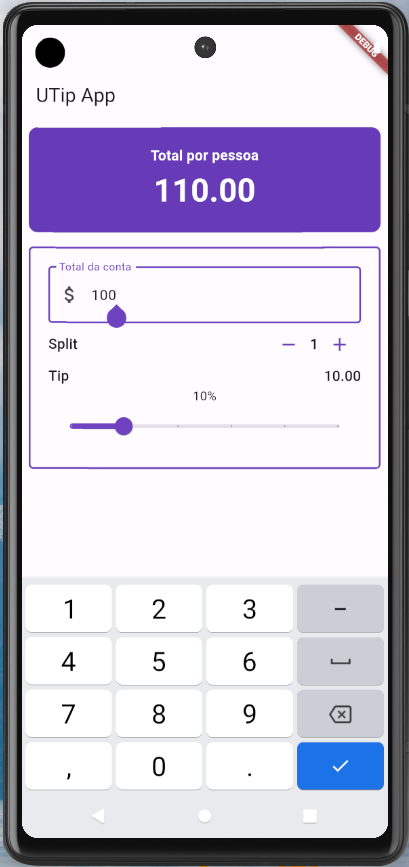

# Utip

<a href="https://flutter.dev/">📲 Flutter</a>
</h1>

 Calculadora de divisão simples de conta de restaurante

<h1 align="center">
  
  
</h1>

### Pré-requisitos

Não se aplica

### 🛠 Tecnologias

As seguintes ferramentas foram usadas na construção do projeto:

- [Flutter](https://flutter.dev/)

### 📦 Pacotes
  <!-- - provider: ^6.0.5   -->

## Autor
  Thallys Freitas   
  Entre em contato comigo:  |
